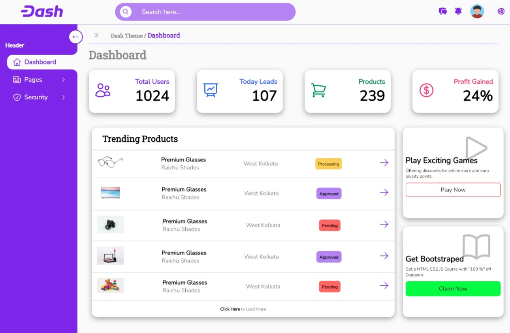
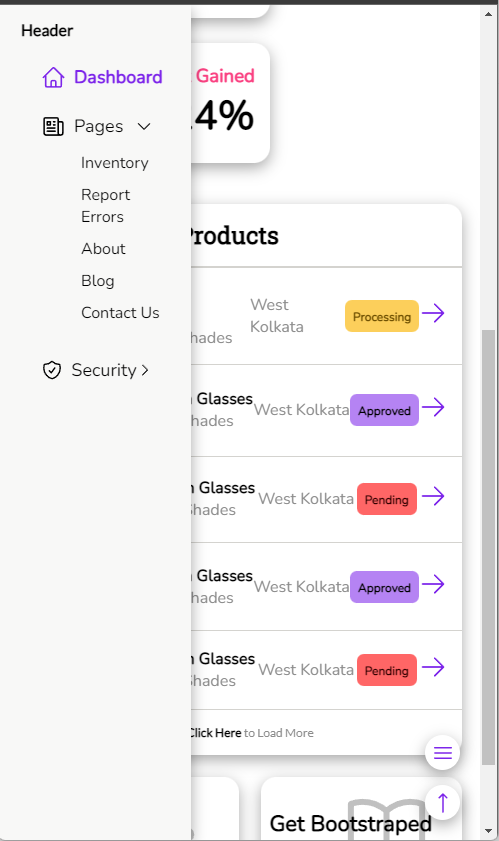
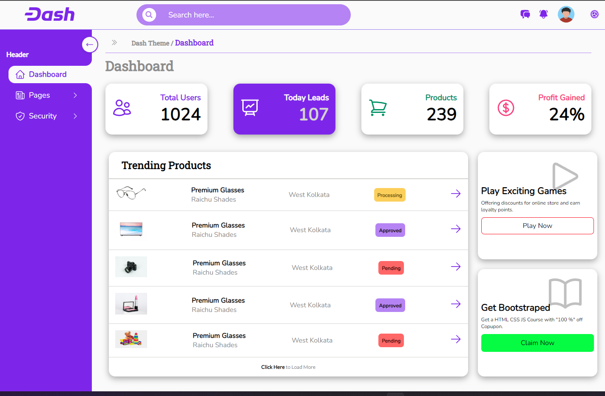
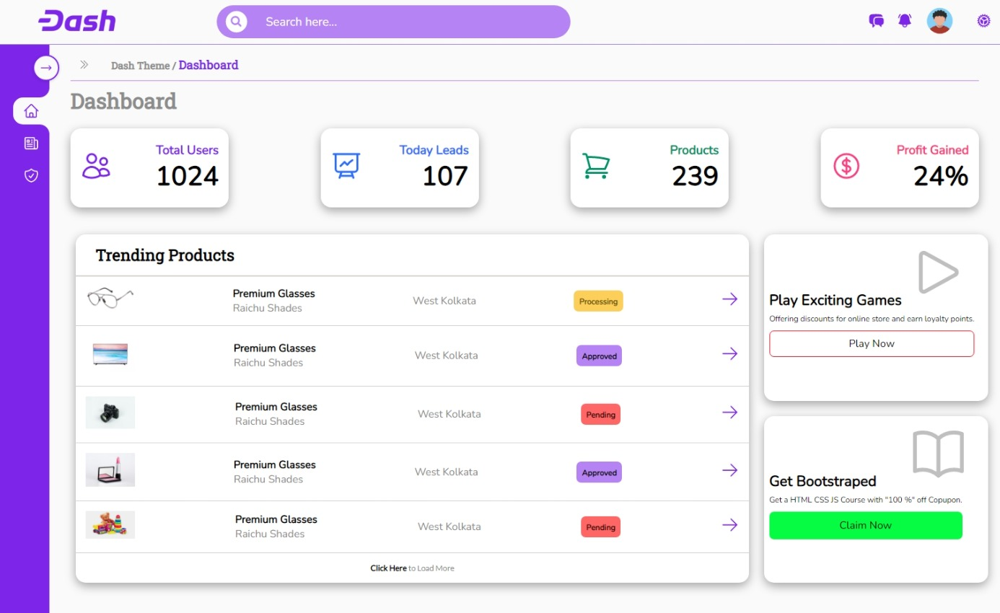
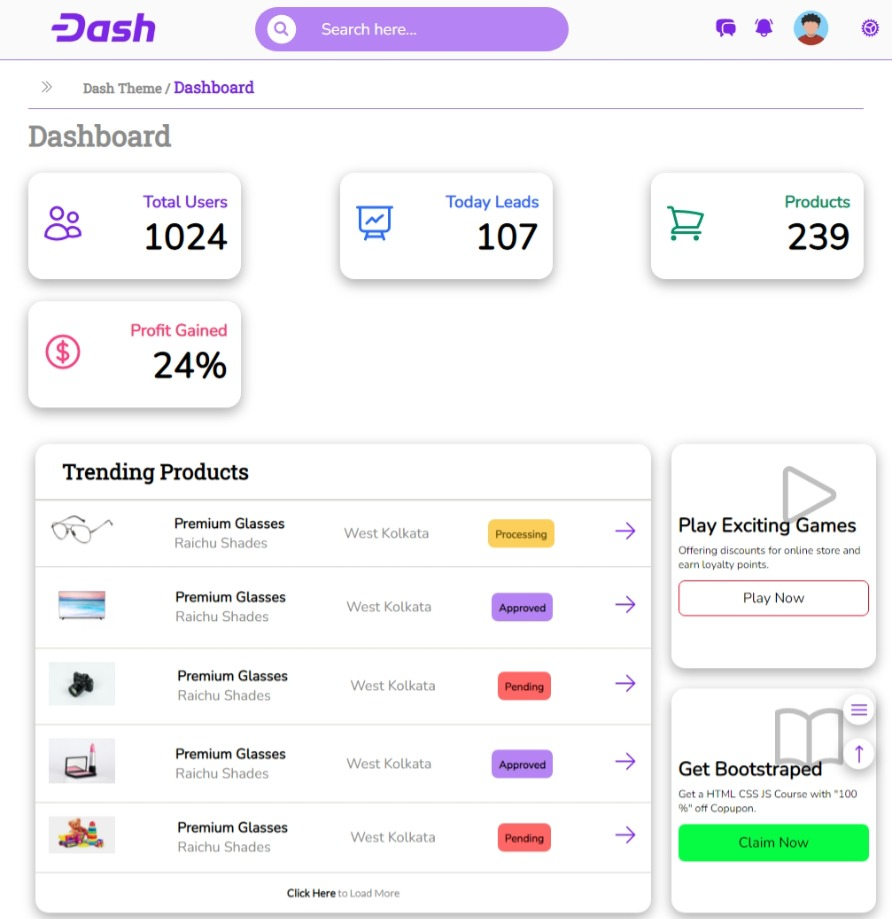

# Admin Dashboard - HTML, SASS, JS

Admin Dashboard is the simple layout practice project, to keep up the ***SASS & JS*** concept. The design of this project is very simple, randomly took from *Google Images*.

**NOTE: Kindly ignore the color scheme, I was confused what to use, later decided to go with**

- Primary Color: **#7D26EA**,
**More colors in variables file.**
- Fonts: **Nunito, Roboto, Lato (Google Fonts)**

### Live URL :- [Check Out](https://ravindra135.github.io/Dashboard-template-HTML-SASS-JS/)

### Built With

- HTML
- SASS - [Read About it](https://sass-lang.com/)
- JS

### Screenshots;

* Desktop View

* Mobile View

* Desktop Hover States

* Desktop Nav Squeezed

* Ipad Design

### Licence - Feel Free to Edit Licence

**If you have any suggestions or improvement please feel free to write to me; Hope it will help me to Improve myself;**

# Author - R Cube Dev - 21-09-2022

